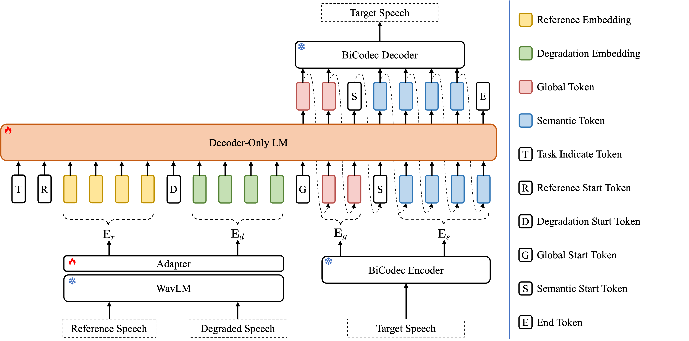

# UniSE: A Unified Framework for Decoder-only Autoregressive LM-based Speech Enhancement

<p align="center">
  <a href="https://arxiv.org/abs/2510.20441">
    
  </a>
  <a href="https://huggingface.co/QuarkAudio/QuarkAudio-UniSE/">
    
  </a>
  <a href="https://www.modelscope.cn/models/QuarkAudio/QuarkAudio-UniSE/">
    
  </a>
</p>

<p align="center">
  <a href="https://arxiv.org/abs/2510.20441"></a>
</p>

🚀 **Key Highlights**:
- ✅ **Unified & Prompt-Free**: Handles multiple tasks without explicit instruction.
- ⚙️ **Decoder-only AR-LM Backbone**: Leverages LLM-style autoregressive generation for speech token prediction.
- 🔄 **End-to-End Compatible**: Integrates WavLM (feature extractor), BiCodec (discrete codec), and LM into one pipeline.
- 🌍 **Multitask Support**: SR, TSE, SS, and more — all in a single model.

📄 **Paper**: [arXiv:2510.20441](https://arxiv.org/abs/2510.20441)  | 🤗 **Model**: [Hugging Face Spaces](https://huggingface.co/QuarkAudio/QuarkAudio-UniSE/)

---

## 📋 Supported Tasks

| Task | Full Name | Status | Description |
|------|-----------|--------|-------------|
| **SR** | Speech Restoration | ✅ Stable | General-purpose denoising and clarity improvemen (e.g., noise, reverb, packet loss) |
| **TSE** | Target Speaker Extraction | ✅ Stable | Extract target speaker using reference enrollment audio |
| **SS** | Speech Separation | ✅ Stable | Separate mixed speakers or sound sources |
| **AEC** | Acoustic Echo Cancellation | ⏳ Developing | Coming soon in next release |

---

## 🎯 Quick Start: Run Inference in 3 Minutes

### 1. Clone Repository

```bash
git clone https://github.com/alibaba/unified-audio.git
cd QuarkAudio-UniSE
```

### 2. Create a Conda environment and install dependencies

```bash
conda create -n unise python=3.10
conda activate unise
pip install -r requirements.txt
```

### 3. Download Model Assets


UniSE needs the pretrained model assets of BiCodec, please download the files in https://huggingface.co/SparkAudio/Spark-TTS-0.5B and put them into `./pretrained/Spark-TTS-0.5B`.
After Downloading, the tree should be like this:

```
./pretrained/Spark-TTS-0.5B
|-- BiCodec
|   |-- config.yaml
|   `-- model.safetensors
|-- config.yaml
`-- wav2vec2-large-xlsr-53
    |-- README.md
    |-- config.json
    |-- preprocessor_config.json
    `-- pytorch_model.bin
```

### 4. Runtime Layout

Generated and downloaded artifacts are kept separate:

```
./logs          # TensorBoard, W&B, and Slurm/live logs
./checkpoints   # training and inference .ckpt files
./pretrained    # downloaded public model assets
./outputs       # generated audio or temporary inference outputs
```

For this aligned setup:

```
./logs/tau_fixed          # TAU fixed-pair TensorBoard and W&B logs
./logs/slurm              # Slurm stdout/stderr and live logs
./checkpoints/tau_fixed   # TAU fine-tuning checkpoints
```

Here `TAU` refers to the local TAU task/data directory used by the configs, such as `/scratch/work/lil14/data/TAU/...`; it is not a Python package in this repository.

## Scripts

Slurm tasks use one entry point:

```bash
bash scripts/slurm.sh train
bash scripts/slurm.sh infer
bash scripts/slurm.sh smoke_sr
```

Useful overrides:

```bash
CONFIG_PATH=conf/tau_fixed_unise.yaml bash scripts/slurm.sh train
CKPT_PATH=checkpoints/tau_fixed/version_2/best_epoch=23-step=000864-valid_loss=7.467.ckpt bash scripts/slurm.sh infer
```

Directory inference preserves the input folder layout:

```bash
INPUT_ROOT=/path/to/noisy OUTPUT_ROOT=/path/to/enhanced bash scripts/infer_directory.sh
```

## USE Simulation Data

This repository supports two USE Simulation data modes through `dataset_type`:

```yaml
dataset_type: use_simulation_onthefly
```

uses online degradation from USE Simulation.

```yaml
dataset_type: use_simulation_fixed
```

uses a fixed pair manifest, such as the TAU fixed-pair CSVs in `conf/tau_fixed_unise.yaml`.

## Train
+ Quick start

```bash
#!/bin/bash
python ./train.py --config conf/config.yaml
```

| Parameter        | Description                                                                                                                                                            |
| ---------------- | ---------------------------------------------------------------------------------------------------------------------------------------------------------------------- |
| `resume` | if want to resume, specify ckpt path                                                                                                  |
| `simulation_config` | data simulate config                                                                                                                        |
| `speech_scp_path`        | SCP of clean audio files                                                       |
| `noise_scp_path`        | SCP of noise audio files                                                                   
 | `rir_scp_path`        | SCP of rir audio files                                                                       |


## Inference
+ Quick start
The main inference script is **`test.py`**. The inference process consists of two stages:

1. Extract hidden states from all WavLM layers and obtain a single representation by averaging them across layers.
2. Use the language model (LM) to predict speech tokens autoregressively, and then decode them into audio using **BiCodec**.

### Running Inference
+ Quick start
To run test.py, configure the parameters in `./conf/config.yaml`:

| Parameter        | Description                                                                                                                                                            |
| ---------------- | ---------------------------------------------------------------------------------------------------------------------------------------------------------------------- |
| `ckpt_path` | pretrained weight                                                                                                             |
| `enroll_duration` | Number of inference iterations.                                                                                                                                        |
| `data_src_dir`        | Directory of processed audio files directory.                                                        |
| `data_tgt_dir`        | Directory of processed audio files directory.                                                                                                                                    |
| `mode`           | Task type: `se` (Speech Restoration), `tse` (Target Speaker Extraction), `ss` (Speech Separation). |

Command to run inference:

```python
python test.py
```


## Model Checkpoints

Our pretrained model is available on [Hugging Face](https://huggingface.co/QuarkAudio/QuarkAudio-UniSE/).


## Citation

```
@misc{yan2025uniseunifiedframeworkdecoderonly,
      title={UniSE: A Unified Framework for Decoder-only Autoregressive LM-based Speech Enhancement}, 
      author={Haoyin Yan and Chengwei Liu and Shaofei Xue and Xiaotao Liang and Zheng Xue},
      year={2025},
      eprint={2510.20441},
      archivePrefix={arXiv},
      primaryClass={cs.SD},
      url={https://arxiv.org/abs/2510.20441}, 
}
```


## Contact
For any questions, please contact: `yanhaoyin.yhy@alibaba-inc.com`
 
