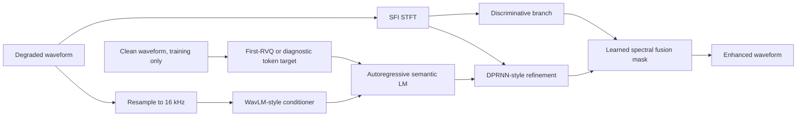

# Hybrid-UniSE Engineering Study

> [!IMPORTANT]
> This is a non-official, paper-inspired research code archive. It is not a
> paper-exact reproduction, does not ship trained weights, and does not claim a
> validated speech-enhancement result.

This repository presents the clean public surface of an engineering study of a
hybrid discriminative-generative speech-enhancement pipeline. Its purpose is to
show what was implemented, which contracts were exercised, what failed in the
limited experiments, and where the work stopped.

## Project status

| Item | Status |
|---|---|
| Hybrid model code | Available for inspection |
| Synthetic tensor-flow smoke path | Available |
| Compatible trained checkpoint | Not provided |
| Public evaluation set or result manifest | Not provided |
| Paper-exact implementation | No |
| Reproduction of reported paper results | No |
| Active training or variant search | Stopped |

The repository should therefore be read as an engineering and negative-results
record, not as a released enhancement model.

## What is implemented


```mermaid
flowchart LR
    X["Degraded waveform"] --> SFI["SFI STFT"]
    SFI --> D["Discriminative branch"]
    X --> R["Resample to 16 kHz"]
    R --> W["WavLM-style conditioner"]
    W --> LM["Autoregressive semantic LM"]
    LM --> G["DPRNN-style refinement"]
    SFI --> G
    D --> F["Learned spectral fusion mask"]
    G --> F
    F --> Y["Enhanced waveform"]
    C["Clean waveform, training only"] --> T["First-RVQ or diagnostic token target"]
    T --> LM
```

The code includes:

- a multi-sample-rate SFI STFT front end;
- a TF-GridNet-style discriminative branch;
- WavLM conditioning and semantic-token interfaces;
- Transformer-encoder and LLaMA-style autoregressive LM paths;
- DPRNN-style generative refinement;
- learned complex-spectral fusion;
- stage freezing and checkpoint architecture guards;
- explicit optional adapters for external quality losses.

Several blocks are implementation choices because the paper and public assets
do not specify everything needed for an exact reconstruction. See
[architecture.md](docs/architecture.md).

## Research outcome

The strongest result is an engineering result: the major tensor routes,
masking rules, stage wiring, and checkpoint contracts were implemented and
exercised. That does **not** establish enhancement efficacy.

| Question | Limited evidence | Conclusion |
|---|---|---|
| Are the branches wired together? | Shape, mask, causality, loss, and checkpoint contract checks | Engineering path exists; quality is unproven |
| Did the WavLM-KMeans AR target work? | Four frozen step-200 diagnostic samples | Positional agreement was about 1.35%; first errors were at positions 2/2/4/2 |
| What did the first errors look like? | Same four samples | All copied the predecessor, but every predecessor was token 5, so the cause is confounded |
| Did decoding penalties produce a candidate? | Ten screened settings | No setting passed the complete candidate gate |
| Did the predecessor-margin idea help? | Static implementation only | It was never run as a treatment; there is no efficacy conclusion |
| Is final audio quality established? | No public checkpoint or result manifest | No |

These figures are a historical internal diagnostic snapshot with a very small
sample size, not a benchmark. The full evidence boundary and stopped directions
are documented in [research-status.md](docs/research-status.md).

## Repository map

```text
conf/
  hybrid_unise_smoke.yaml    # tiny synthetic contract configuration
  hybrid_unise_example.yaml  # architecture-scale example, no assets
docs/
  architecture.md            # data flow and implementation choices
  provenance.md              # origin, licenses, and excluded assets
  research-status.md         # verified observations and limitations
model/
  audio/                     # STFT and alignment utilities
  hybrid_*.py                # branches, LM, losses, composition, inference
  wavlm_utils.py             # WavLM length and mask handling
  xcodec_backends.py         # optional tokenizer adapter
scripts/
  validate_hybrid_config.py  # no-torch YAML contract check
  smoke_hybrid_forward.py    # random-input tensor-flow smoke
  infer_hybrid_directory.py  # checkpoint-required directory inference
tests/
  test_public_contracts.py   # small public contract suite
```

Dataset-specific loaders, cluster launchers, private paths, stopped experiment
runners, upstream demo assets, and machine environment dumps are deliberately
not part of this public snapshot.

## Quick inspection

Python 3.10 or newer is recommended.

`requirements.txt` is a readable minimum dependency contract, not a frozen
reproduction environment.

```bash
python -m venv .venv
source .venv/bin/activate
python -m pip install -r requirements.txt
```

For the small public test suite, install `requirements-dev.txt` instead.

```bash
python -m pip install -r requirements-dev.txt
python -m pytest -q
```

Validate the two public configurations without importing PyTorch:

```bash
python scripts/validate_hybrid_config.py \
  conf/hybrid_unise_smoke.yaml \
  conf/hybrid_unise_example.yaml
```

Run the synthetic tensor-flow smoke:

```bash
python scripts/smoke_hybrid_forward.py \
  --config conf/hybrid_unise_smoke.yaml \
  --device cpu
```

The smoke command uses random waveforms, random model weights, and a
deterministic token stub. Passing it demonstrates tensor compatibility and
finite outputs only; it does not demonstrate speech enhancement.

## Checkpoint-required inference

No checkpoint is included. If you have a trusted, architecture-compatible
checkpoint:

```bash
python scripts/infer_hybrid_directory.py \
  --config conf/hybrid_unise_example.yaml \
  --stage fusion \
  --checkpoint /path/to/trusted.ckpt \
  --input-root /path/to/noisy_audio \
  --output-root outputs/example
```

Checkpoint loading is tensor-only and strict. Hugging Face remote code is
disabled by default; enabling it is an explicit trust decision. See
[SECURITY.md](SECURITY.md).

## What the tests prove

The small public suite checks selected mathematical and interface contracts. It
does not validate:

- convergence;
- metric improvement;
- perceptual quality;
- paper-faithful data preparation;
- compatibility with an unpublished checkpoint;
- the claims or results of the referenced paper.

## Provenance and license

The codebase began from Alibaba's
[unified-audio / QuarkAudio-UniSE](https://github.com/alibaba/unified-audio/tree/main/QuarkAudio-UniSE)
and is distributed under the Apache License 2.0. This snapshot contains
substantial independent modifications and is not affiliated with Alibaba.
See [NOTICE](NOTICE), [LICENSE](LICENSE), and
[provenance.md](docs/provenance.md).

External model weights and datasets are not covered by this repository's code
license and are not included.

## References

- [A Hybrid Discriminative and Generative System for Universal Speech Enhancement](https://arxiv.org/abs/2601.19113)
- [Alibaba unified-audio](https://github.com/alibaba/unified-audio)
