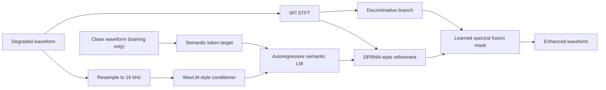

# Hybrid-UniSE Research Engineering Repository

> **Status:** complete engineering record prepared for research review. This is
> not an official implementation, a paper-exact reproduction, or a released
> speech-enhancement model.

This single repository preserves the full Hybrid-UniSE work carried out in this
project: the upstream UniSE/BiCodec baseline, the paper-inspired hybrid
implementation, data pipelines, runnable contracts, experiment configurations,
tests, and the negative or inconclusive results that determined where the work
stopped.

## Project at a glance

| Area | Current status |
|---|---|
| Upstream UniSE/BiCodec baseline | Preserved for provenance and comparison |
| Hybrid discriminative-generative path | Implemented and covered by engineering tests |
| Data loaders and staged training entry points | Preserved |
| Historical experiment configurations | Preserved and clearly marked as machine-bound |
| Compatible Hybrid checkpoint | Not included |
| Validated Hybrid enhanced-audio result | Not established |
| Paper-exact reproduction | Not achieved or claimed |
| Active variant search / GPU validation | Stopped |

The main result is therefore an **auditable engineering study**, not a quality
claim.

## What was implemented

The Hybrid path combines two estimates on a shared spectral grid:


```mermaid
flowchart LR
    X["Degraded waveform"] --> SFI["SFI STFT"]
    SFI --> D["Discriminative branch"]
    X --> R["Resample to 16 kHz"]
    R --> W["WavLM-style conditioner"]
    W --> LM["Autoregressive semantic LM"]
    LM --> G["DPRNN-style refinement"]
    SFI --> G
    D --> F["Learned spectral fusion mask"]
    G --> F
    F --> Y["Enhanced waveform"]
    C["Clean waveform (training only)"] --> T["Semantic token target"]
    T --> LM
```

The repository includes:

- the original decoder-only UniSE/BiCodec path;
- a multi-sample-rate SFI STFT front end;
- a TF-GridNet-style discriminative branch;
- WavLM conditioning and semantic-token interfaces;
- Transformer and LLaMA-style autoregressive LM paths;
- DPRNN-style generative refinement;
- learned complex-spectral fusion;
- native, fixed-pair, WebDataset, and rolling-cache data routes;
- staged training, inference, evaluation, and diagnostic scripts;
- checkpoint architecture and objective-identity guards;
- focused experiment contracts, including the never-run predecessor-margin
  treatment package.

Several Hybrid blocks are local implementation choices because the paper and
available assets do not specify everything required for an exact reconstruction.
See [Architecture and implementation choices](docs/architecture.md).

## Evidence and outcome

| Question | Evidence retained here | Bounded conclusion |
|---|---|---|
| Is the Hybrid route implemented? | Shape, mask, loss, stage, data, and checkpoint tests | The engineering path exists |
| Did the WavLM-KMeans free-running target work? | Recorded identities and metrics for four frozen step-200 diagnostic samples | Positional agreement was about 1.35%; the sample is too small for a general claim |
| What happened at the first error? | Positions 2 / 2 / 4 / 2 | All copied the predecessor, but all predecessors were token 5, so the cause is confounded |
| Did decoding penalties yield a candidate? | Ten screened settings | No setting passed the complete gate |
| Did the predecessor-margin idea help? | Static implementation and an auditable paired-run contract | No treatment was run; there is no efficacy result |
| Is final Hybrid audio quality established? | No compatible checkpoint or result manifest | No |

These are limited internal diagnostics, not benchmark results. The exact
evidence boundary is recorded in [Research status](docs/research-status.md).

## Start here

For a structured review, read in this order:

1. [Architecture and implementation choices](docs/architecture.md)
2. [Research status and stopped directions](docs/research-status.md)
3. [Repository provenance](docs/provenance.md)
4. [Configuration guide](conf/README.md)
5. [Script guide](scripts/README.md)
6. [Historical engineering notes](docs/archive/)

## Repository layout

```text
assets/
  upstream/                   # inherited demo audio and figure; not Hybrid output
  archive/                    # retained development diagnostic artifacts
conf/
  examples/                   # portable inspection and synthetic smoke configs
  templates/                  # data-contract templates with explicit placeholders
  experiments/                # historical, often cluster-bound experiment configs
  archive/                    # retained generated/obsolete config snapshots
  generated/                  # ignored runtime-generated configs
dataloader/                   # native, fixed-pair, WebDataset, and cache loaders
docs/
  architecture.md             # current implementation map
  research-status.md          # verified observations and limitations
  provenance.md               # upstream and asset boundaries
  archive/                    # historical implementation/experiment contracts
model/
  hybrid_*.py                 # Hybrid-UniSE branches, composition, and objectives
  audio/                      # SFI STFT and alignment utilities
  bicodec/                    # preserved upstream BiCodec implementation
  llm/                        # preserved upstream UniSE LM implementation
scripts/
  README.md                   # safe entry-point and risk classification
  cluster/                    # cluster-specific scripts; may submit Slurm jobs
  *.py                        # training, evaluation, validation, and diagnostics
tests/                        # engineering contract tests
checkpoints/ logs/ outputs/
pretrained/ runs/ tmp/        # ignored runtime artifact locations
train.py / test.py            # preserved upstream-compatible entry points
```

## Local inspection

Python 3.10 is the original project baseline. The environment files describe
the research setup; they are not a frozen, portable reproduction guarantee.

Install development dependencies only if you want to run the tests:

```bash
python -m pip install -r requirements-dev.txt
python -m pytest -q
```

The configuration validator does not require a checkpoint:

```bash
python scripts/validate_hybrid_config.py \
  conf/examples/hybrid_unise_smoke.yaml \
  conf/examples/hybrid_unise_example.yaml
```

The synthetic smoke path uses random waveforms, random model weights, and a
deterministic token stub:

```bash
python scripts/smoke_hybrid_forward.py \
  --config conf/examples/hybrid_unise_smoke.yaml \
  --device cpu
```

A passing smoke run demonstrates tensor compatibility and finite outputs only.
It does not demonstrate speech enhancement.

## Operational boundaries

- Files under `conf/experiments/` preserve real experiment intent and may
  contain cluster-specific absolute paths. They are documentary until adapted
  to another environment.
- Files under `scripts/cluster/` are not Quick Start commands. In particular,
  the Slurm helper can submit a job only after an explicit confirmation gate.
- `assets/upstream/audio_samples/` and the upstream figure were inherited from
  QuarkAudio-UniSE. They are references, not outputs of this Hybrid project.
- Checkpoints, pretrained weights, datasets, and project-produced result audio
  are not included.
- No command in this README downloads assets, submits a job, or starts training.

## Source boundary

The codebase began from Alibaba's
[unified-audio / QuarkAudio-UniSE](https://github.com/alibaba/unified-audio/tree/main/QuarkAudio-UniSE)
and retains substantial upstream code alongside independent Hybrid-UniSE
modifications. It is not affiliated with Alibaba and is not an official
implementation of the referenced Hybrid-UniSE paper.

See [Repository provenance](docs/provenance.md) for code and asset boundaries.

## Related papers

- [A Hybrid Discriminative and Generative System for Universal Speech Enhancement](https://arxiv.org/abs/2601.19113)
- [UniSE: A Unified Framework for Decoder-only Autoregressive LM-based Speech Enhancement](https://arxiv.org/abs/2510.20441)
